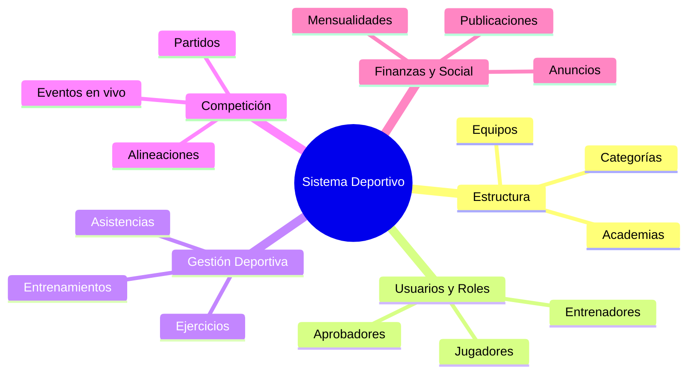

# Sistema de Gestión de Academias Deportivas

---

### **Trabajo Final — Modelo y Arquitectura de Base de Datos**

 

**Docente:** Chang Uribe, Luis
 
**Asignatura:** Desarrollo de Soluciones Móviles
 
**Institución:** UNIVERSIDAD ESAN 

 

## 1. Planteamiento de la Problemática

SportPro nace de la necesidad de centralizar la gestión de una academia deportiva. Actualmente, información como jugadores, entrenamientos, asistencia, convocatorias y eventos de partidos puede estar dispersa en diferentes medios.

* **Fragmentación de la información:** Desconexión entre los datos del usuario, el seguimiento deportivo (asistencias, convocatorias) y la gestión administrativa (cobro de mensualidades).
* **Falta de trazabilidad en el rendimiento:** Dificultad para consolidar el historial táctico de los jugadores, estadísticas de partidos y la evolución de los entrenamientos a lo largo del tiempo.
* **Procesos de comunicación deficientes:** Pérdida de control en la difusión de convocatorias, avisos oficiales y la interacción comunitaria entre entrenadores, alumnos y tutores.
* **Ausencia de auditoría:** Incapacidad para registrar cambios o eventos críticos durante la competición en tiempo real sin arriesgar la integridad de la información.

---

  

## 2. Alcance inicial del Sistema

Sistema diseñado para administrar el ecosistema completo de una academia deportiva: gestión de usuarios, entrenamientos, convocatorias, eventos en vivo y métricas de rendimiento.

Frente a la fragmentación de la información, **SportPro** unifica la gestión operativa, deportiva, competitiva y administrativa en una sola arquitectura de datos.

### Cobertura del Sistema:

---

  

## 3. Prototipo de la solucion (APP MOBILE)

A continuación, se presentan las interfaces que conforman la solución. Puede acceder al prototipo interactivo completo a través del siguiente enlace: https://www.figma.com/design/a7EoShWmu4aNmpDflKFMkr/DPA-MOBILE?node-id=0-1&p=f&t=IXfgaaehuav27ECg-0

### Modulo Usuarios y Roles

### Modulo Gestion Depotiva 
Planificar entrenamientos y controlar asistencia

  

## 4. Reglas de Negocio y Privacidad

| codigo | Negocio |
| --- | --- |
|RN-01 | (Jerarquía de Roles): El sistema debe gestionar 5 roles principales con permisos diferenciados: Administrador (ADM), Entrenador/Director Técnico (DT), Jugador (JUG), Apoderado/Padre (PAD) y Espectador/Comunidad (COM).|
|RN-02 | (Vinculación Obligatoria de Menores): Todo usuario registrado como Jugador menor de edad (según fecha de nacimiento) debe tener asignada obligatoriamente la cuenta de un Apoderado validado.|
| RN-03 | (Moderación de Publicaciones y Comentarios): Todos los posts y comentarios en el muro comunitario están sujetos a reporte. Si una publicación acumula un número predefinido de reportes o es marcada por un Moderador, su visibilidad se ocultará automáticamente en el muro general hasta su revisión.|

 

| codigo | Privacidad |
| --- | --- |
| RP-01 | (Ocultamiento de Datos Sensibles de Menores): Ningún usuario con rol Espectador, Jugador de otro equipo o miembro de la Comunidad podrá ver datos de contacto (teléfono, correo), ficha física (peso, altura) ni teléfono de emergencia de un atleta.|
| RP-02 | (Acceso de Apoderados): El Apoderado tiene acceso de lectura completo sobre asistencias, convocatorias y mensualidades únicamente de sus atletas asociados.|
| RP-03 | (Filtro Anti-Exposición de Menores en Muro): Está prohibido publicar en el muro comunitario números telefónicos, direcciones exactas o documentos de identidad de atletas menores de edad.|

  

## 4. Historias de Usuario
El producto fue dividido en 15 historias de usuario, priorizadas según las funcionalidades necesarias para la plataforma
 

<b>US-01</b>

| | |
| --- | --- |
|**Número:** | `US-01` |
| **Rol:** | `Usuario` |
|**Nombre de Historia:** | `Autenticación y Asignación de Roles en la Plataforma` |
| **Puntos de historia estimados:** | `2 SP` |
|**Programador responsable:** | `Romulo` |
|**Prioridad:** | Alta |

---

**Descripción:**

> **Como** usuario nuevo de SportPro,  
> **quiero** registrarme como (Entrenador, Jugador, Apoderado o Administrador),  
> **para** acceder a las funcionalidades correspondientes a mis permisos dentro de la academia.

---

### Criterios de aceptación

>- **Dado** que un usuario ingresa por primera vez,
  **cuando** complete el formulario de registro con (nombre, correo, contraseña, confirmar contraseña) y seleccione su rol (ENTRENADOR, JUGADOR, APODERADO, ADMINISTRADOR),
  **entonces** el sistema creará su cuenta y su perfil.

>- **Dado** un usuario completando los datos de registro,
  **cuando** le de click al botón crear cuenta,
  **entonces** la aplicación deberá validar los datos como un correo valido, contraseña.

>- **Dado** un usuario que use un email que ya existe en el sistema asociado a un usuario creado,
  **cuando** intente crear su usuario,
  **entonces** el sistema validará y mostrará un mensaje de error "El usuario ya existe con ese email".

--- 

  

<b>US-02</b>

| | |
| --- | --- |
|**Número:** | `US-02` |
| **Rol:** | `Usuario` |
|**Nombre de Historia:** | `Inicio de sesión` |
| **Puntos de historia estimados:** | `2 SP` |
|**Programador responsable:** | `Romulo` |
|**Prioridad:** | Alta |

---

**Descripción:**

> **Como** usuario nuevo de SportPro (Entrenador, Jugador, Apoderado o Administrador),  
> **quiero** iniciar sesión con correo/contraseña y mi rol,  
> **para** acceder a las funcionalidades correspondientes a mis permisos dentro de la academia.

---

### Criterios de aceptación

>- **Dado** un usuario registrado como Jugador menor de edad,
  **cuando** inicie sesión,
  **entonces** la aplicación le solicitará vincular el correo de su apoderado.

>- **Dado** un usuario con credenciales inválidas,
  **cuando** intente iniciar sesión,
  **entonces** el sistema mostrará un mensaje de error claro sin revelar detalles de seguridad.

---

  

<b>US-03</b>

|  |  |
| --- | --- |
| **Número:** | `US-03` |
| **Rol:** | `Entrenador / Administrador` |
| **Nombre de Historia:** | `Registro e Inicialización de Equipo o Academia` |
| **Puntos de historia estimados:** | `3 SP` |
| **Programador responsable:** | `Romulo` |
| **Prioridad:** | Alta |

---

**Descripción:**

> **Como** Entrenador o Administrador de SportPro,
> **quiero** registrar una nueva academia o equipo de fútbol con sus datos básicos,
> **para** comenzar a gestionar la estructura, categorías y miembros del club dentro de la plataforma.

---

### Criterios de aceptación

> * **Dado** un Entrenador o Administrador autenticado,
> **cuando** complete el formulario de creación con (nombre de la academia/equipo, escudo/logo, ciudad),
> **entonces** el sistema guardará la información .
> 
> 

> * **Dado** un usuario intentando registrar un equipo,
> **cuando** presione el botón de guardar sin completar los campos obligatorios (nombre de la academia y ciudad),
> **entonces** el sistema no procesará el registro y mostrará mensajes de validación indicando los campos requeridos.
> 
> 

> * **Dado** un Administrador o Entrenador,
> **cuando** ingrese un nombre de equipo que ya existe registrado bajo su misma gestión,
> **entonces** el sistema mostrará un mensaje de alerta: "Ya cuentas con una academia o equipo registrado con este nombre".
> 
> 

---

  

<b>US-04</b>

|  |  |
| --- | --- |
| **Número:** | `US-04` |
| **Rol:** | `Entrenador / Administrador` |
| **Nombre de Historia:** | `Gestión de Categorías del Equipo` |
| **Puntos de historia estimados:** | `2 SP` |
| **Programador responsable:** | `Romulo` |
| **Prioridad:** | Alta |

---

**Descripción:**

> **Como** Entrenador o Administrador,
> **quiero** crear y organizar sub-divisiones (ej. Sub-10, Sub-15, Primera) dentro del equipo o academia,
> **para** estructurar las planillas de jugadores y agrupar los entrenamientos según rangos de edad o nivel competitivo.

---

### Criterios de aceptación

> * **Dado** que el Administrador o Entrenador se encuentra en el perfil de su equipo,
> **cuando** agregue una nueva categoría especificando su nombre (ej. Sub-12) y año límite de nacimiento,
> **entonces** la categoría se añadirá al panel del equipo y quedará disponible para asignar jugadores.
> 
> 

> * **Dado** que un Entrenador intenta crear una categoría duplicada en el mismo equipo (ej. dos categorías "Sub-15"),
> **cuando** guarde los cambios,
> **entonces** el sistema mostrará el error "La categoría ya existe en este equipo".
> 
> 

---

  

<b>US-03</b>

  Aquí tienes el desglose de la historia de usuario **US-05** dividida en dos historias independientes, de alcance más acotado (1 SP cada una) y siguiendo la metodología **INVEST** (independientes, negociables, valiosas, estimables, pequeñas y testeables).

---

  

<b>US-05</b>

|  |  |
| --- | --- |
| **Número:** | `US-05` |
| **Rol:** | `Jugador / Apoderado / Entrenador` |
| **Nombre de Historia:** | `Registro y actualización de información personal y deportiva del jugador` |
| **Puntos de historia estimados:** | `1 SP` |
| **Programador responsable:** | `Miguel` |
| **Prioridad:** | Alta |

---

#### **Descripción:**

> **Como** jugador o apoderado,
> **quiero** registrar y actualizar la información personal y deportiva del jugador (posición, pie hábil y dorsal),
> **para** mantener su perfil técnico actualizado dentro de la academia.

---

#### **Criterios de aceptación:**

>-* **Dado** que el usuario ingresa al formulario de registro/edición de ficha,
**cuando** complete o modifique los campos de *Datos Personales* (fecha de nacimiento) y *Datos Deportivos* (posición principal/secundaria, pie hábil, dorsal) con formatos válidos,
**entonces** el sistema debe guardar o actualizar los cambios y mostrarlos reflejados en la vista de la ficha técnica.
  
>-* **Dado** que el usuario ingresa datos en blanco o con formato inválido en los campos obligatorios,
**cuando** intente guardar la ficha,
**entonces** el sistema debe mostrar mensajes de validación indicando los errores sin persistir la información.

---

   

<b>US-06</b>

|  |  |
| --- | --- |
| **Número:** | `US-06` |
| **Rol:** | `Jugador / Apoderado / Entrenador` |
| **Nombre de Historia:** | `Gestión del contacto de emergencia del jugador` |
| **Puntos de historia estimados:** | `1 SP` |
| **Programador responsable:** | `Miguel` |
| **Prioridad:** | Alta |

---

#### **Descripción:**

> **Como** jugador, apoderado o entrenador,
> **quiero** registrar, actualizar y consultar un contacto de emergencia asociado a la ficha del jugador,
> **para** disponer de un canal directo de comunicación ante cualquier eventualidad médica o imprevisto en entrenamientos/partidos.

---

#### **Criterios de aceptación:**

>-* **Dado** que un usuario autorizado edita el perfil de un jugador,
**cuando** ingrese los datos de un contacto de emergencia (nombre, parentesco y número telefónico válido),
**entonces** el sistema debe asociar dicho contacto al jugador.

>-* **Dado** que se consulta la ficha de un jugador existente,
**cuando** el usuario acceda a la sección de emergencia,
**entonces** el sistema debe mostrar la tarjeta/botón de *Contacto de Emergencia* permitiendo la interacción directa (p. ej., llamada telefónica rápida al hacer clic).

---
---

  

<b>US-07</b>

| | |
| --- | --- |
|**Número:** | `US-07` |
| **Rol:** | `Administrador` |
|**Nombre de Historia:** | `Registro simulado de mensualidades` |
| **Puntos de historia estimados:** | `1 SP` |
|**Programador responsable:** | `Miguel` |
|**Prioridad:** | Media |

---

**Descripción:**

> **Como** administrador,  
> **quiero** registrar y consultar el estado de las mensualidades de los jugadores,  
> **para** llevar un control básico de los pagos de la academia.

---

### Criterios de aceptación

>- **Dado** un jugador registrado,
  **cuando** el administrador registre una mensualidad como pagada,
  **entonces** el sistema deberá almacenar el periodo, monto y estado del pago.

>- **Dado** un jugador con mensualidades registradas,
  **cuando** el administrador consulte su información,
  **entonces** deberá visualizar el estado de sus pagos.

>- **Dado** una mensualidad pendiente,
  **cuando** se consulte el estado del jugador,
  **entonces** el sistema deberá mostrarla como pendiente.

---

  

<b>US-08</b>

| | |
| --- | --- |
|**Número:** | `US-08` |
| **Rol:** | `Entrenador` |
|**Nombre de Historia:** | `Planificación de entrenamientos y ejercicios` |
| **Puntos de historia estimados:** | `4 SP` |
|**Programador responsable:** | `Rodrigo` |
|**Prioridad:** | Media |

---

**Descripción:**

> **Como** entrenador,  
> **quiero** planificar sesiones de entrenamiento y asociar ejercicios a cada sesión,  
> **para** organizar las actividades deportivas de los jugadores.

---

### Criterios de aceptación

>- **Dado** un entrenador autorizado,
  **cuando** cree una sesión indicando fecha, hora, equipo y objetivo,
  **entonces** el sistema deberá registrar el entrenamiento.

>- **Dado** un entrenamiento creado,
  **cuando** el entrenador agregue ejercicios,
  **entonces** estos deberán quedar asociados a la sesión correspondiente.

>- **Dado** un entrenamiento planificado,
  **cuando** el entrenador consulte su agenda,
  **entonces** deberá visualizar las sesiones programadas y sus ejercicios.

---

  

<b>US-09</b>

| | |
| --- | --- |
|**Número:** | `US-09` |
| **Rol:** | `Entrenador` |
|**Nombre de Historia:** | `Control de asistencia a entrenamientos` |
| **Puntos de historia estimados:** | `1 SP` |
|**Programador responsable:** | `Romulo` |
|**Prioridad:** | Media |

---

**Descripción:**

> **Como** entrenador,  
> **quiero** registrar la asistencia de los jugadores a cada entrenamiento,  
> **para** realizar un seguimiento de su participación en las sesiones deportivas.

---

### Criterios de aceptación

>- **Dado** un entrenamiento programado,
  **cuando** el entrenador consulte la lista de jugadores,
  **entonces** podrá marcar a cada jugador como presente o ausente.

>- **Dado** que se registre la asistencia,
  **cuando** se guarde la información,
  **entonces** el sistema deberá asociarla al entrenamiento y jugador correspondiente.

>- **Dado** un entrenamiento con asistencia registrada,
  **cuando** se consulte posteriormente,
  **entonces** deberán visualizarse los estados registrados.

---

  

<b>US-10</b>

| | |
| --- | --- |
|**Número:** | `US-10` |
| **Rol:** | `Entrenador / Jugador` |
|**Nombre de Historia:** | `Convocatoria y confirmación de disponibilidad` |
| **Puntos de historia estimados:** | `2 SP` |
|**Programador responsable:** | `Miguel` |
|**Prioridad:** | Alta |

---

**Descripción:**

> **Como** entrenador,  
> **quiero** convocar jugadores para un partido y permitir que estos confirmen su disponibilidad,  
> **para** conocer con anticipación quiénes participarán en el encuentro.

---

### Criterios de aceptación

>- **Dado** un partido programado,
  **cuando** el entrenador seleccione los jugadores convocados,
  **entonces** el sistema deberá registrar la convocatoria.

>- **Dado** un jugador convocado,
  **cuando** consulte la convocatoria,
  **entonces** podrá indicar si está disponible o no.

>- **Dado** que los jugadores respondan la convocatoria,
  **cuando** el entrenador consulte el partido,
  **entonces** podrá visualizar la disponibilidad de cada convocado.

---

  

<b>US-11</b>

| | |
| --- | --- |
|**Número:** | `US-11` |
| **Rol:** | `Entrenador` |
|**Nombre de Historia:** | `Armado táctico de alineación` |
| **Puntos de historia estimados:** | `4 SP` |
|**Programador responsable:** | `Miguel` |
|**Prioridad:** | Alta |

---

**Descripción:**

> **Como** entrenador,  
> **quiero** seleccionar jugadores y ubicarlos en una formación táctica,  
> **para** definir la alineación que participará en un partido.

---

### Criterios de aceptación

>- **Dado** un partido con jugadores disponibles,
  **cuando** el entrenador cree una alineación,
  **entonces** podrá seleccionar los jugadores que participarán.

>- **Dado** una alineación creada,
  **cuando** el entrenador asigne posiciones,
  **entonces** el sistema deberá mostrar visualmente la distribución de los jugadores.

>- **Dado** una alineación válida,
  **cuando** el entrenador la guarde,
  **entonces** deberá quedar asociada al partido correspondiente.

---

  

<b>US-12</b>

| | |
| --- | --- |
|**Número:** | `US-12` |
| **Rol:** | `Entrenador / Operador` |
|**Nombre de Historia:** | `Consola de registro de eventos en vivo` |
| **Puntos de historia estimados:** | `4 SP` |
|**Programador responsable:** | `Roberth` |
|**Prioridad:** | Alta |

---

**Descripción:**

> **Como** entrenador u operador del partido,  
> **quiero** registrar eventos deportivos durante el encuentro,  
> **para** mantener una representación actualizada de lo que ocurre en tiempo real.

---

### Criterios de aceptación

>- **Dado** un partido iniciado,
  **cuando** el operador registre un evento,
  **entonces** el sistema deberá guardar el tipo de evento, jugador involucrado y minuto correspondiente.

>- **Dado** un evento registrado,
  **cuando** se confirme la acción,
  **entonces** deberá aparecer inmediatamente en la consola del partido.

>- **Dado** que el partido esté finalizado,
  **cuando** se intente registrar un nuevo evento,
  **entonces** el sistema deberá impedir la operación.

---

  

<b>US-13</b>

| | |
| --- | --- |
|**Número:** | `US-13` |
| **Rol:** | `Jugador / Apoderado / Espectador` |
|**Nombre de Historia:** | `Marcador y cronología en tiempo real` |
| **Puntos de historia estimados:** | `2 SP` |
|**Programador responsable:** | `Roberth` |
|**Prioridad:** | Alta |

---

**Descripción:**

> **Como** usuario de SportPro,  
> **quiero** visualizar el marcador y los eventos de un partido en tiempo real,  
> **para** conocer el desarrollo del encuentro.

---

### Criterios de aceptación

>- **Dado** un partido en curso,
  **cuando** se registre un evento que modifique el marcador,
  **entonces** el marcador deberá actualizarse.

>- **Dado** un partido en curso,
  **cuando** se registre un evento,
  **entonces** deberá aparecer en la cronología del partido.

>- **Dado** un usuario consultando el partido,
  **cuando** existan nuevos eventos,
  **entonces** deberá visualizar la información actualizada.

---

  

<b>US-14</b>

| | |
| --- | --- |
|**Número:** | `US-14` |
| **Rol:** | `Entrenador / Administrador` |
|**Nombre de Historia:** | `Corrección y trazabilidad de eventos` |
| **Puntos de historia estimados:** | `2 SP` |
|**Programador responsable:** | `Juan P.` |
|**Prioridad:** | Alta |

---

**Descripción:**

> **Como** entrenador o administrador,  
> **quiero** corregir eventos registrados incorrectamente y conservar un historial de los cambios,  
> **para** garantizar la trazabilidad de la información del partido.

---

### Criterios de aceptación

>- **Dado** un evento registrado incorrectamente,
  **cuando** un usuario autorizado lo modifique,
  **entonces** el sistema deberá actualizar el evento.

>- **Dado** un evento modificado,
  **cuando** se consulte su historial,
  **entonces** deberá visualizarse qué información fue modificada y cuándo.

>- **Dado** un usuario sin permisos,
  **cuando** intente modificar un evento,
  **entonces** el sistema deberá rechazar la operación.

---

  

<b>US-15</b>

| | |
| --- | --- |
|**Número:** | `US-15` |
| **Rol:** | `Entrenador` |
|**Nombre de Historia:** | `Resumen narrativo con IA y aprobación DT` |
| **Puntos de historia estimados:** | `4 SP` |
|**Programador responsable:** | `Ana L.` |
|**Prioridad:** | Alta |

---

**Descripción:**

> **Como** entrenador,  
> **quiero** generar un resumen narrativo del partido utilizando inteligencia artificial y revisarlo antes de publicarlo,  
> **para** comunicar de manera sencilla los principales acontecimientos del encuentro.

---

### Criterios de aceptación

>- **Dado** un partido finalizado con eventos registrados,
  **cuando** el entrenador solicite un resumen,
  **entonces** el sistema deberá generar una propuesta narrativa basada en los eventos registrados.

>- **Dado** un resumen generado,
  **cuando** el entrenador lo revise,
  **entonces** podrá aprobarlo o solicitar modificaciones antes de publicarlo.

>- **Dado** un resumen aprobado,
  **cuando** se confirme su publicación,
  **entonces** deberá quedar asociado al partido y disponible para los usuarios autorizados.

---

  

<b>US-16</b>

| | |
| --- | --- |
|**Número:** | `US-16` |
| **Rol:** | `Usuario registrado` |
|**Nombre de Historia:** | `Muro de comunidad, posts y comentarios` |
| **Puntos de historia estimados:** | `2 SP` |
|**Programador responsable:** | `Ana L.` |
|**Prioridad:** | Media |

---

**Descripción:**

> **Como** usuario registrado de SportPro,  
> **quiero** publicar contenido y comentar publicaciones dentro de un muro de comunidad,  
> **para** compartir información e interactuar con otros miembros de la academia.

---

### Criterios de aceptación

>- **Dado** un usuario autenticado,
  **cuando** cree una publicación con contenido válido,
  **entonces** el sistema deberá mostrarla en el muro de la comunidad.

>- **Dado** una publicación existente,
  **cuando** un usuario autorizado agregue un comentario,
  **entonces** este deberá aparecer asociado a la publicación.

>- **Dado** el muro de comunidad,
  **cuando** el usuario ingrese,
  **entonces** deberá visualizar las publicaciones disponibles ordenadas por fecha.

---

  

<b>US-17</b>

| | |
| --- | --- |
|**Número:** | `US-17` |
| **Rol:** | `Entrenador / Administrador / Jugador` |
|**Nombre de Historia:** | `Avisos de pruebas y convocatorias abiertas` |
| **Puntos de historia estimados:** | `2 SP` |
|**Programador responsable:** | `Carlos R.` |
|**Prioridad:** | Media |

---

**Descripción:**

> **Como** usuario de SportPro,  
> **quiero** visualizar avisos sobre pruebas deportivas y convocatorias abiertas,  
> **para** conocer oportunidades de participación dentro de la academia.

---

### Criterios de aceptación

>- **Dado** un administrador o entrenador autorizado,
  **cuando** publique un aviso de prueba o convocatoria,
  **entonces** el sistema deberá mostrarlo en la sección correspondiente.

>- **Dado** un aviso publicado,
  **cuando** un usuario consulte la sección de convocatorias,
  **entonces** deberá visualizar la información, fecha y condiciones de participación.

>- **Dado** un aviso cuya fecha de vigencia haya terminado,
  **cuando** el usuario consulte las convocatorias,
  **entonces** deberá identificarse como cerrado o dejar de mostrarse como convocatoria abierta.

---

  

<b>US-18</b>

| | |
| --- | --- |
|**Número:** | `US-18` |
| **Rol:** | `Moderador / Administrador` |
|**Nombre de Historia:** | `Moderación y reporte de publicaciones` |
| **Puntos de historia estimados:** | `1 SP` |
|**Programador responsable:** | `María G.` |
|**Prioridad:** | Alta |

---

**Descripción:**

> **Como** moderador o administrador,  
> **quiero** revisar publicaciones reportadas y gestionar contenido que incumpla las normas de la comunidad,  
> **para** mantener un espacio de interacción adecuado para los usuarios.

---

### Criterios de aceptación

>- **Dado** una publicación reportada por un usuario,
  **cuando** el moderador consulte los reportes,
  **entonces** deberá visualizar la publicación y el motivo del reporte.

>- **Dado** un contenido que incumpla las normas,
  **cuando** el moderador decida retirarlo,
  **entonces** el sistema deberá ocultar la publicación del muro.

>- **Dado** un reporte revisado,
  **cuando** el moderador determine que no existe incumplimiento,
  **entonces** podrá cerrar el reporte sin eliminar la publicación.

  

## 4. Modelo Inicial de Datos

```mermaid
erDiagram

    USUARIO {
        int id_usuario PK
        string nombre
        string apellido
        string correo
        string password
        string rol
        string fotografia
        datetime fecha_registro
        string estado
    }

    ACADEMIA {
        int id_academia PK
        string nombre
        string descripcion
        string ubicacion
        datetime fecha_registro
        string estado
    }

    EQUIPO {
        int id_equipo PK
        int id_academia FK
        string nombre
        string categoria
        datetime fecha_creacion
        string estado
    }

    JUGADOR {
        int id_jugador PK
        int id_usuario FK
        int id_equipo FK
        date fecha_nacimiento
        string posicion
        float altura
        float peso
        string telefono
        string contacto_emergencia
        string telefono_emergencia
        string estado
    }

    ENTRENADOR {
        int id_entrenador PK
        int id_usuario FK
        int id_academia FK
    }

    ENTRENAMIENTO {
        int id_entrenamiento PK
        int id_equipo FK
        date fecha
        time hora_inicio
        time hora_fin
        string objetivo
        text observaciones
        string estado
    }

    EJERCICIO {
        int id_ejercicio PK
        string nombre
        text descripcion
        string objetivo
        int duracion
        string categoria
        string estado
    }

    ENTRENAMIENTO_EJERCICIO {
        int id_entrenamiento FK
        int id_ejercicio FK
        int orden
        int duracion
        text observaciones
    }

    ASISTENCIA {
        int id_asistencia PK
        int id_entrenamiento FK
        int id_jugador FK
        string estado
        text observaciones
    }

    PARTIDO {
        int id_partido PK
        int id_equipo_local FK
        int id_equipo_visitante FK
        date fecha
        time hora
        string ubicacion
        string estado
        int marcador_local
        int marcador_visitante
    }

    CONVOCATORIA {
        int id_convocatoria PK
        int id_partido FK
        int id_jugador FK
        string disponibilidad
        datetime fecha_respuesta
        text observaciones
    }

    ALINEACION {
        int id_alineacion PK
        int id_partido FK
        int id_jugador FK
        string tipo
        string posicion
        int numero_camiseta
    }

    EVENTO_PARTIDO {
        int id_evento PK
        int id_partido FK
        string tipo_evento
        int minuto
        int segundo
        int id_equipo FK
        int id_jugador FK
        text observaciones
        string estado
        datetime fecha_registro
    }

    HISTORIAL_EVENTO {
        int id_historial PK
        int id_evento FK
        string accion
        json datos_anterior
        json datos_nuevo
        int id_usuario FK
        datetime fecha
    }

    ESTADISTICA_JUGADOR {
        int id_estadistica PK
        int id_jugador FK
        int partidos
        int titularidades
        int goles
        int asistencias
        int tarjetas_amarillas
        int tarjetas_rojas
    }

    RESUMEN_PARTIDO {
        int id_resumen PK
        int id_partido FK
        text contenido
        string estado
        datetime fecha_generacion
        datetime fecha_aprobacion
        int id_aprobador FK
    }

    MENSUALIDAD {
        int id_mensualidad PK
        int id_jugador FK
        string periodo
        decimal monto
        string estado
        date fecha_vencimiento
        datetime fecha_actualizacion
    }

    PUBLICACION {
        int id_publicacion PK
        int id_usuario FK
        text contenido
        datetime fecha_publicacion
        string estado
    }

    COMENTARIO {
        int id_comentario PK
        int id_publicacion FK
        int id_usuario FK
        text contenido
        datetime fecha_publicacion
        string estado
    }

    REACCION {
        int id_reaccion PK
        int id_publicacion FK
        int id_usuario FK
        string tipo
        datetime fecha
    }

    ANUNCIO {
        int id_anuncio PK
        int id_usuario FK
        string titulo
        text contenido
        string tipo
        fecha_publicacion datetime
        fecha_expiracion datetime
        string estado
    }

    CONVOCATORIA_ABIERTA {
        int id_convocatoria_abierta PK
        int id_equipo FK
        string titulo
        text descripcion
        string categoria
        string posicion
        datetime fecha_prueba
        string ubicacion
        datetime fecha_publicacion
        string estado
    }

    REPORTE {
        int id_reporte PK
        int id_usuario_reportante FK
        int id_publicacion FK
        int id_comentario FK
        string motivo
        text descripcion
        string estado
        datetime fecha_reporte
    }

    %% Relaciones
    ACADEMIA ||--o{ EQUIPO : "posee"
    ACADEMIA ||--o{ ENTRENADOR : "emplea"
    USUARIO ||--o{ JUGADOR : "es"
    USUARIO ||--o{ ENTRENADOR : "es"
    USUARIO ||--o{ HISTORIAL_EVENTO : "registra"
    USUARIO ||--o{ RESUMEN_PARTIDO : "aprueba"
    USUARIO ||--o{ PUBLICACION : "crea"
    USUARIO ||--o{ COMENTARIO : "escribe"
    USUARIO ||--o{ REACCION : "reacciona"
    USUARIO ||--o{ ANUNCIO : "publica"
    USUARIO ||--o{ REPORTE : "reporta"
    EQUIPO ||--o{ JUGADOR : "pertenece"
    JUGADOR ||--o{ ASISTENCIA : "registra"
    JUGADOR ||--o{ CONVOCATORIA : "recibe"
    JUGADOR ||--o{ ALINEACION : "participa"
    JUGADOR ||--o{ EVENTO_PARTIDO : "ejecuta"
    JUGADOR ||--o{ ESTADISTICA_JUGADOR : "acumula"
    JUGADOR ||--o{ MENSUALIDAD : "paga"
    EQUIPO ||--o{ ENTRENAMIENTO : "realiza"
    ENTRENAMIENTO ||--o{ ENTRENAMIENTO_EJERCICIO : "contiene"
    EJERCICIO ||--o{ ENTRENAMIENTO_EJERCICIO : "se_asigna"
    ENTRENAMIENTO ||--o{ ASISTENCIA : "registra"
    EQUIPO ||--o{ PARTIDO : "juega_local"
    EQUIPO ||--o{ PARTIDO : "juega_visitante"
    EQUIPO ||--o{ EVENTO_PARTIDO : "registra"
    PARTIDO ||--o{ CONVOCATORIA : "organiza"
    PARTIDO ||--o{ ALINEACION : "define"
    PARTIDO ||--o{ EVENTO_PARTIDO : "ocurre_en"
    PARTIDO ||--o{ RESUMEN_PARTIDO : "genera"
    EVENTO_PARTIDO ||--o{ HISTORIAL_EVENTO : "audita"
    PUBLICACION ||--o{ COMENTARIO : "tiene"
    PUBLICACION ||--o{ REACCION : "recibe"
    PUBLICACION ||--o{ REPORTE : "es_reportada"
    COMENTARIO ||--o{ REPORTE : "es_reportado"
    EQUIPO ||--o{ CONVOCATORIA_ABIERTA : "publica"
```

<b> Haz clic para desplegar / contraer el diagrama completo</b>

